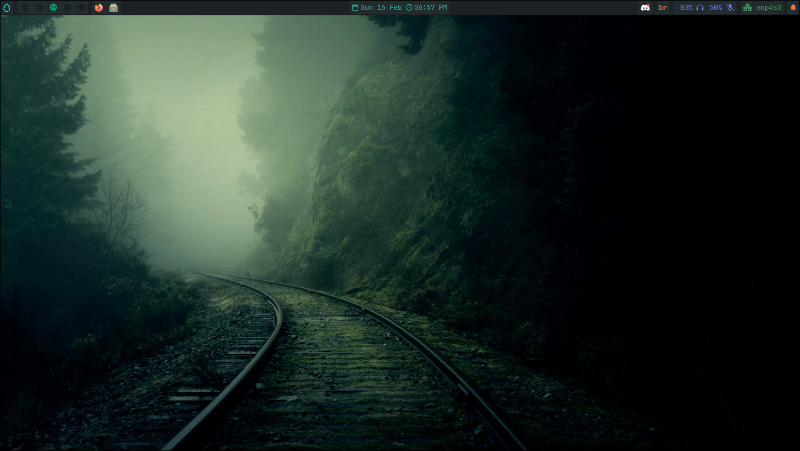
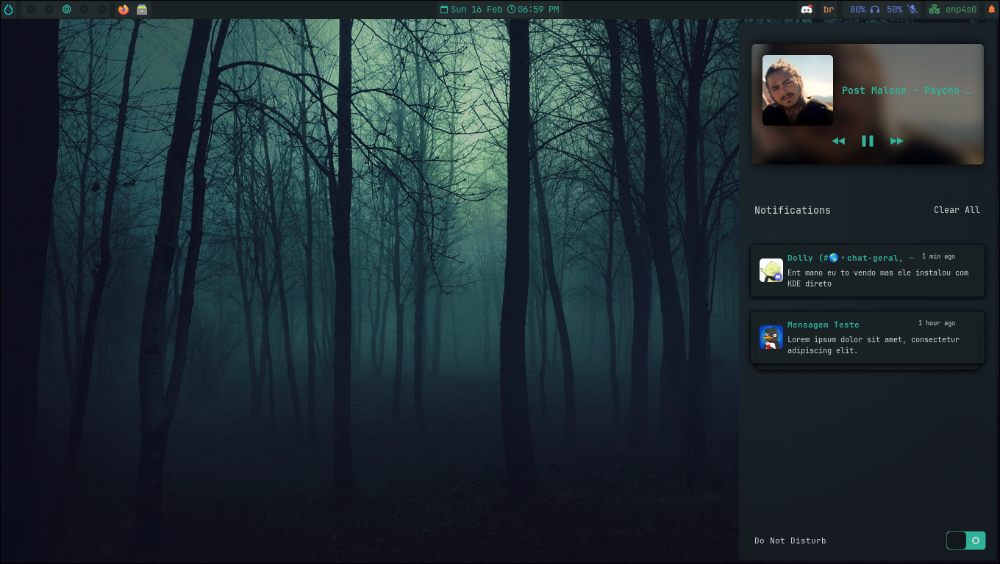
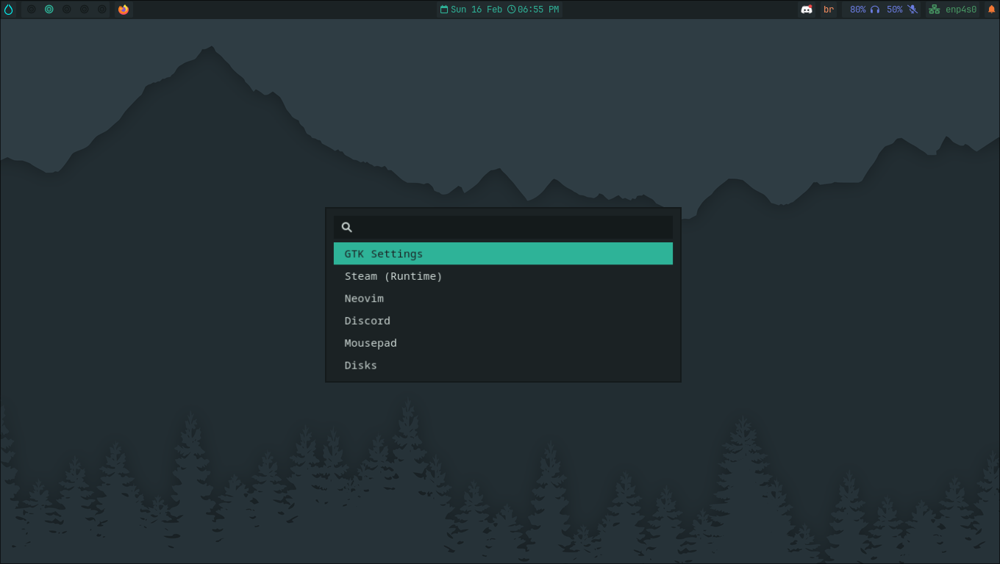

<section style="display: flex; justify-content: flex-start;">
  
  

    
This repository contains personalized configurations for Hyprland, along with scripts created to optimize and automate various tasks in the workspace.
     
    The configurations include adjustments to the compositor's behavior, keyboard shortcuts, and application integrations.

  

</section>

 

## Preview

 

## Keybindings
| Keys                                                                                              | Action                    |
| :---                                                                                              | :---                      |
| <kbd>Super</kbd>  +   <kbd>T</kbd>                                                                | Terminal Emulator         |
| <kbd>Super</kbd>  +   <kbd>B</kbd>                                                                | Web browser               |
| <kbd>Super</kbd>  +   <kbd>E</kbd>                                                                | File Manager              |
| <kbd>Super</kbd>  +   <kbd>C</kbd>                                                                | Code Editor               |
| <kbd>Super</kbd>  +   <kbd>M</kbd>                                                                | System Monitor            |
| <kbd>Super</kbd>  +   <kbd>L</kbd>                                                                | Lock Screen               |
| <kbd>Super</kbd>  +   <kbd>CTRL</kbd> +   <kbd>S</kbd>                                            | Screenshot                |
| <kbd>Super</kbd>  +   <kbd>Q</kbd>                                                                | Close focused window      |
| <kbd>Super</kbd>  +   <kbd>W</kbd>                                                                | Toggle the window float   |
| <kbd>Super</kbd>  +   <kbd>←</kbd><kbd>↑</kbd><kbd>→</kbd><kbd>↓</kbd>                            | Move Focus                |
| <kbd>Super</kbd>  +   <kbd>Shift</kbd>    +   <kbd>←</kbd><kbd>↑</kbd><kbd>→</kbd><kbd>↓</kbd>    | Change Window             |
| <kbd>Super</kbd>  +   <kbd>Shift</kbd>    +   <kbd>[0-9]</kbd>                                    | Move to Workspaces        |
| <kbd>Super</kbd>  +   <kbd>[0-9]</kbd>                                                            | Switch workspaces         |

 

## Custom Scripts
| Keys                                                                                              | Action                    |
| :---                                                                                              | :---                      |
| <kbd>Super</kbd>  +   <kbd>Space</kbd>                                                            | Application Launcher      |
| <kbd>Super</kbd>  +   <kbd>CTRL</kbd> +   <kbd>F4</kbd>                                           | Power menu                |
| <kbd>Super</kbd>  +   <kbd>CTRL</kbd> +   <kbd>B</kbd>                                            | Launch/Restart Waybar     |
| <kbd>Super</kbd>  +   <kbd>CTRL</kbd> +   <kbd>W</kbd>                                            | Launch/Restart swww       |
| <kbd>Super</kbd>  +   <kbd>CTRL</kbd> +   <kbd>K</kbd>                                            | Switch keyboard layout    |

 

> [!NOTE]
> You can find all keybindings [here](.config/hypr/src/keybindings.conf)
